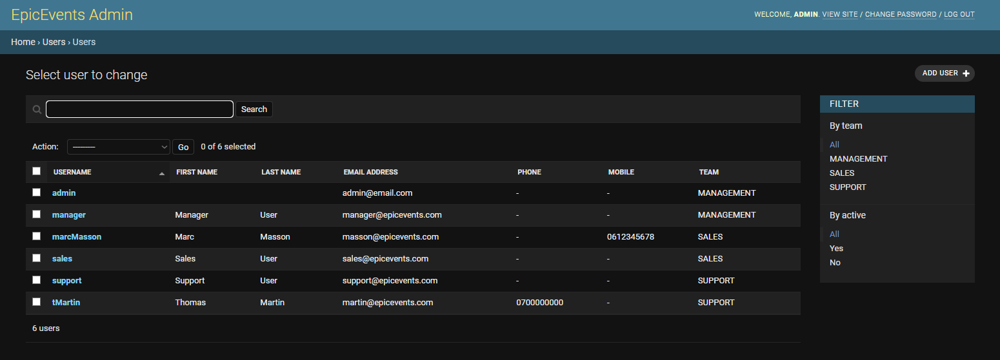
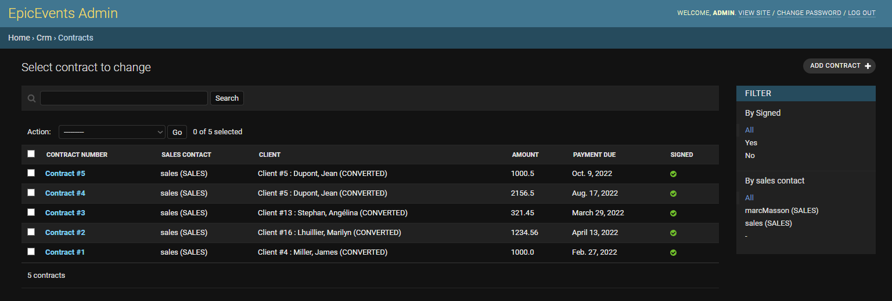
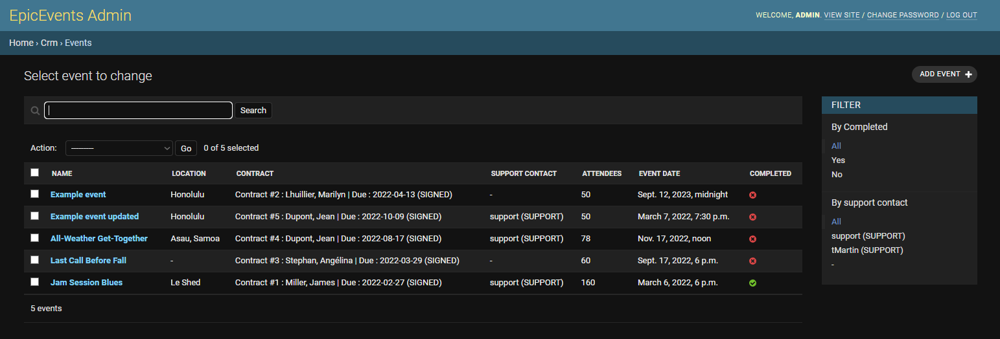
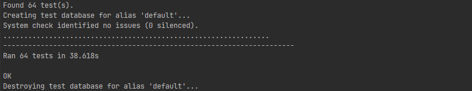

<p align="center">
  
  
</p>

<p align="center">
  <a href="https://www.python.org">
    
  </a>
  <a href="https://www.djangoproject.com">
    
  </a>
    <a href="https://www.django-rest-framework.org/">
    
  </a>
<a href="https://documenter.getpostman.com/view/19098124/UVkvHCLn">
    
  </a>
</p>

# About the project

**OpenClassrooms Python Developer Project #12: Develop a Secure Back-End Architecture Using Django ORM**

_Tested on Windows 10 - Python 3.9.5 - Django 4.0.6 - DRF 3.13.1_

### Objectives

**API-EpicEvents** is a RESTful API designed for _Epic Events_, an events management company.

Epic Events users can:
- Create and update a client database
- Create and manage contracts and organise related events

The API is implemented with a secured database built with Django ORM and PostgreSQL.

## Documentation

Pour plus de détails sur le fonctionnement de cette API, se référer à sa 
[documentation](https://documenter.getpostman.com/view/19098124/UVkvHCLn) (Postman), 
et le [diagramme entité-relation](img/erd_epicevents.png) du CRM.

## Post-course optimisation

This project has been optimised after the end of the OpenClassrooms course. 
To view the previously delivered version, please check [this commit](https://github.com/hmignon/P12_mignon_helene/tree/0ad82d7f9b552faddc864a8154e37bf4377e5d4d).

Improvements made to this project include:
- Adding a Team model
- Providing custom management commands to create dummy data
- Optimising test coverage
- General project refactoring

## Initialisation du projet

### Récupération du projet et installation des dépendances

#### Windows
```
git clone https://github.com/hmignon/P12_mignon_helene.git

cd P12_mignon_helene 
python -m venv env 
env\Scripts\activate

pip install -r requirements.txt
```

#### MacOS et Linux
```
git clone https://github.com/hmignon/P12_mignon_helene.git

cd P12_mignon_helene 
python3 -m venv env 
source env/bin/activate

pip install -r requirements.txt
```

### Créer la base de données

Installer [PostgreSQL](https://www.postgresql.org/download/)
Se référer à la [documentation](https://www.postgresql.org) pour le lancement du serveur.

Créer la base de données avec SQL shell (psql) : ```CREATE DATABASE epic_events;```


### Variables d'environnement

Pour générer un fichier .env, lancer le script ```python create_dot_env.py```.
Entrer le nom d'utilisateur et le mot de passe de la base de données précédemment créée.

Une clé secrète Django sera automatiquement générée.


### Migration de la base de données

```
python manage.py migrate
```

### Créer un superuser

```
python manage.py create superuser
```

### Lancer le serveur Django

```
python manage.py runserver
```

## Utilisation

Il est possible de naviguer dans l'API avec différents outils :

- la plateforme [Postman](https://www.postman.com/) ;
- l'outil de commandes [cURL](https://curl.se)

Note : l'accès au CRM par les managers et admins est en lecture seule. 
La création, modification ou suppression d'éléments est possible via le site d'administration.

### Administration

Le site d'administration Django est accessible via http://127.0.0.1:8000/admin/.
Cet accès est possible pour tous les utilisateurs de l'équipe de gestion (management) et les superusers.

Ci-dessous, quelques exemples de l'interface du site d'administration ;

- **Liste des utilisateurs :**



- **Liste des clients :**


- **Liste des contrats :**



- **Liste des événements :**


### Logging

L'application consigne les erreurs et exceptions dans le fichier [errors.log](errors.log).

### Tests

Il est possible d'effectuer les tests via la commande ```python manage.py test```. 

- *Rapport de test le plus récent*




Pour effectuer le test de couverture : ```coverage run --source='.' manage.py test``` puis ```coverage report```.

- *Rapport de couverture le plus récent*

